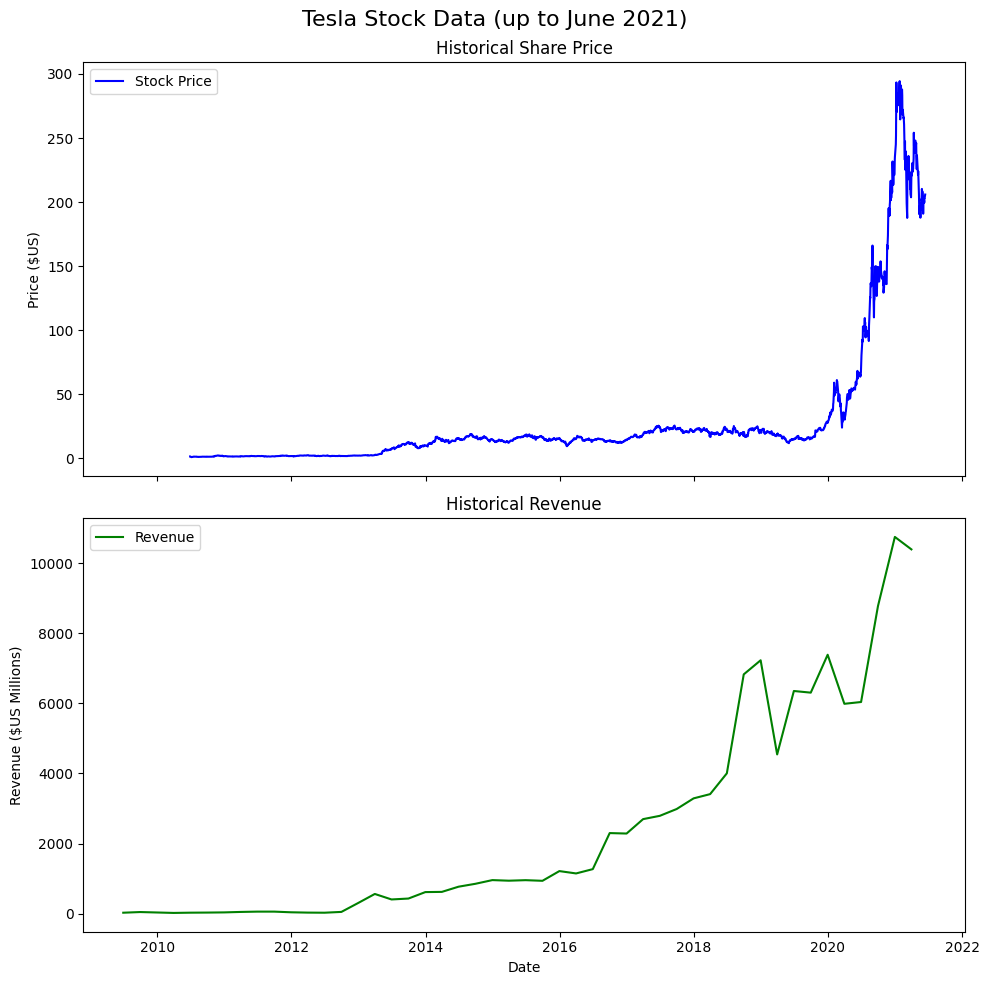
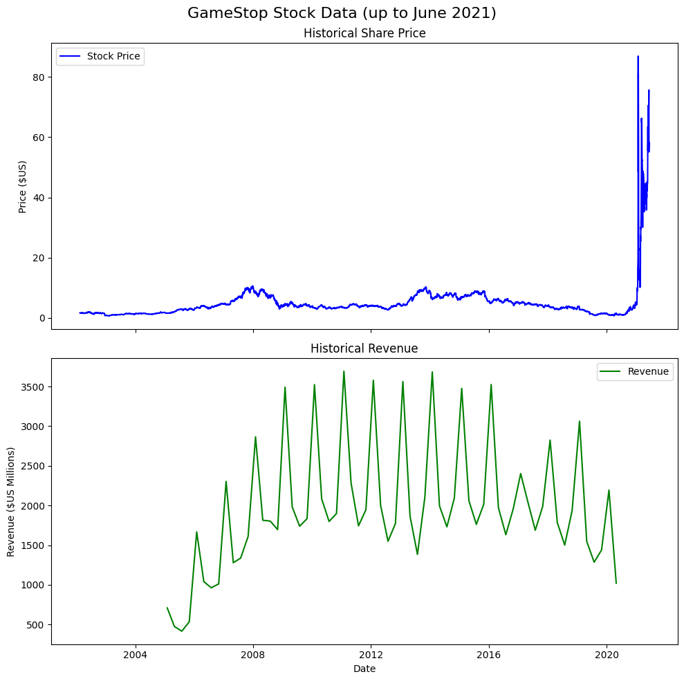

# 📈 GameStop (GME) Stock Data Analysis and Visualization

### Overview
This project provides an in-depth analysis and visualization of **GameStop's (GME)** stock data and quarterly revenue up to June 2021. By leveraging **Python** and popular data science libraries like `pandas`, `plotly`, and `matplotlib`, this project offers an intuitive way to explore GameStop's financial performance.

The project highlights the correlation between GameStop's stock price and its quarterly revenue, allowing for comprehensive insights into the company’s market behavior over time.

---

## ✨ Features

- **Stock Price Analysis**: Explore historical GameStop stock prices using visually appealing charts.
- **Revenue Visualization**: Analyze quarterly revenue data for GameStop, showcasing how it has evolved over time.
- **Interactive Graphs**: Use `plotly` to interact with stock price and revenue data, zoom in/out, and hover over specific data points.
- **Static Charts**: Generate static visualizations using `matplotlib` to ensure compatibility with platforms like GitHub.
- **Comprehensive Data**: Clean and structured stock and revenue data sourced from reliable financial resources.

---

## 🛠 Tools and Libraries

- **pandas**: Used for data cleaning, manipulation, and transformation.
- **plotly**: Generates interactive plots to explore stock price and revenue data in an engaging way.
- **matplotlib**: Provides static visualizations for compatibility with GitHub and other static platforms.
- **requests**: For downloading data from external sources (web scraping).
- **BeautifulSoup**: For parsing HTML and extracting relevant financial information like revenue data.

---

## 📊 Data Sources

The project uses two primary datasets:

1. **Stock Price Data**: Historical stock price data for GameStop (GME) was extracted using reliable APIs.
2. **Revenue Data**: Quarterly revenue data was scraped from financial websites using Python’s `requests` and `BeautifulSoup` libraries.

---

## 🚀 Project Workflow

### 1. Data Extraction
- **Stock Data**: The stock data is fetched using APIs (such as `yfinance` or a CSV dataset).
- **Revenue Data**: The revenue data is extracted from a web page using web scraping techniques.

### 2. Data Cleaning and Processing
- Both datasets are cleaned and formatted using `pandas`. This includes converting date columns to the proper format, handling missing values, and formatting numerical values for easy plotting.

### 3. Visualization
- **Plotly**: Interactive visualizations are created to allow the user to interact with the stock and revenue data. The plots provide hover functionalities, making it easy to inspect exact values.
  
- **Matplotlib**: Static visualizations are generated to ensure compatibility with GitHub. These include dual-axis plots that show stock prices and revenue trends over time.

### 4. Analysis and Insights
- The relationship between stock prices and revenue trends is analyzed. By visualizing both datasets together, users can explore potential correlations between revenue growth and stock price fluctuations.

---

### Tesla Stock Matplotlib Plot

    

## 📷 GameStop Stock Matplotlib Plot

    

---

## 🖼 Visualizations

- **Interactive Graphs**: The project includes interactive `plotly` graphs, allowing users to zoom in, explore, and interact with the data in real time.
- **Static Charts**: `matplotlib` is used to generate static images, which can be exported for reports or presentations.

---
